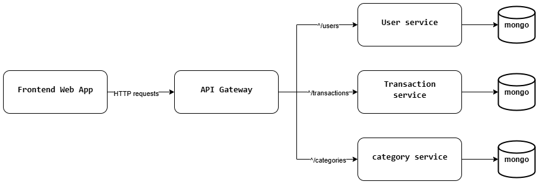
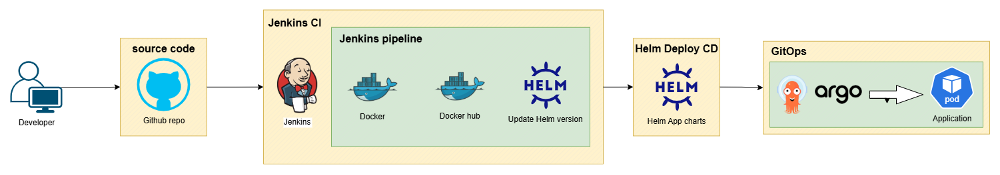

# Expense Tracker DevOps

โปรเจกต์ **Expense Tracker DevOps** เป็นระบบติดตามค่าใช้จ่ายที่ออกแบบมาเพื่อฝึกฝนและสาธิตแนวทางการทำ DevOps โดยประกอบด้วย Frontend, Backend, และ Infrastructure as Code ที่สามารถนำไปใช้งานจริงได้

---

## 🚀 ฟีเจอร์หลัก

- **Frontend**: เว็บแอปพลิเคชันสำหรับผู้ใช้งาน  
- **Backend**: Microservices สำหรับ:
  - `/category-service`: จัดการหมวดหมู่
  - `/user-service`: จัดการผู้ใช้และการยืนยันตัวตน
  - `/transaction-service`: จัดการรายการธุรกรรม
- **Infrastructure**: ใช้ ArgoCD และ Jenkins เพื่อ CI/CD และการจัดการ Kubernetes

---

##  โครงสร้างโปรเจกต์

```
/frontend              # เว็บแอปพลิเคชัน
/backend/category-service      # Microservice สำหรับหมวดหมู่
/backend/user-service          # Microservice สำหรับผู้ใช้
/backend/transaction-service   # Microservice สำหรับรายการธุรกรรม
/charts                # Helm charts สำหรับ Kubernetes
/jenkins               # Jenkins pipeline configuration
/argocd                # ArgoCD application manifests
.gitignore             # รายการไฟล์ที่ไม่ต้องการติดตาม
README.md              # เอกสารนี้
```

---

## 🌐 Web Architecture



**คำอธิบาย**:  
- Frontend ส่ง request ผ่าน API Gateway  
- Gateway แยกไปยัง microservices แต่ละตัว  
- Microservices เก็บข้อมูลใน database ของตัวเอง  

---

## ⚙️ DevOps Workflow



**คำอธิบาย**:  
1. Developer push โค้ดขึ้น GitHub  
2. Jenkins ทำการ build, test และสร้าง Docker image  
3. Docker image ถูก push ไปยัง registry  
4. ArgoCD ตรวจสอบและ deploy image ลง Kubernetes cluster  
5. Microservices ทำงานใน cluster พร้อมให้ frontend เรียกใช้  

---

## ⚙️ วิธีติดตั้งและใช้งาน

### 1. ติดตั้ง Jenkins
- ติดตั้ง Jenkins และติดตั้ง plugins ที่จำเป็น
- ตั้งค่า Jenkins pipeline โดยใช้ไฟล์จาก `/jenkins`

### 2. ติดตั้ง ArgoCD
- ติดตั้ง ArgoCD และตั้งค่าให้เชื่อมต่อกับ Kubernetes cluster
- ใช้ manifests จาก `/argocd` เพื่อสร้างและจัดการแอปพลิเคชัน

### 3. รัน Microservices
- ใช้ Docker หรือ Kubernetes เพื่อรันแต่ละ Microservice
- ตั้งค่าให้แต่ละ service สามารถสื่อสารกันได้

### 4. รัน Frontend
- ติดตั้ง dependencies และรันแอปพลิเคชัน
- ตั้งค่าให้ Frontend เชื่อมต่อกับ Backend services

---

## 📦 เทคโนโลยีที่ใช้

- **Frontend**: Vue.js / React / Svelte  
- **Backend**: Python / FastAPI  
- **CI/CD**: Jenkins / ArgoCD  
- **Infrastructure**: Kubernetes / Docker  

---

## 🧪 การทดสอบ

โปรเจกต์นี้มีการทดสอบอัตโนมัติผ่าน Jenkins pipeline โดยจะทำการ build และ deploy ทุกครั้งที่มีการเปลี่ยนแปลงในโค้ด

---

## 🤝 วิธีมีส่วนร่วม

1. Fork โปรเจกต์นี้  
2. สร้าง branch ใหม่ (`git checkout -b feature/YourFeature`)  
3. ทำการเปลี่ยนแปลงและ commit (`git commit -am 'Add new feature'`)  
4. Push ไปยัง branch ของคุณ (`git push origin feature/YourFeature`)  
5. เปิด Pull Request เพื่อพิจารณารวมโค้ด  

---


